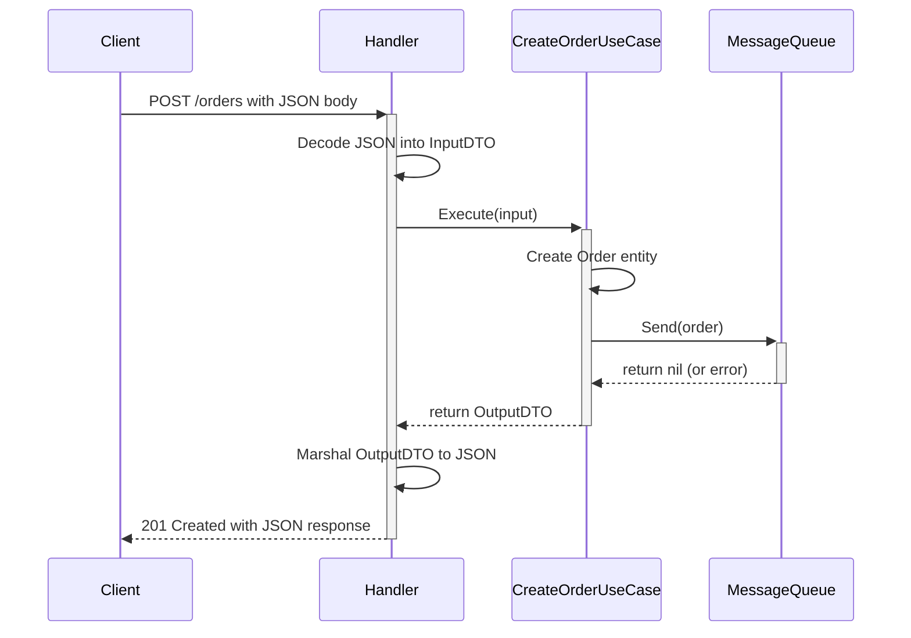
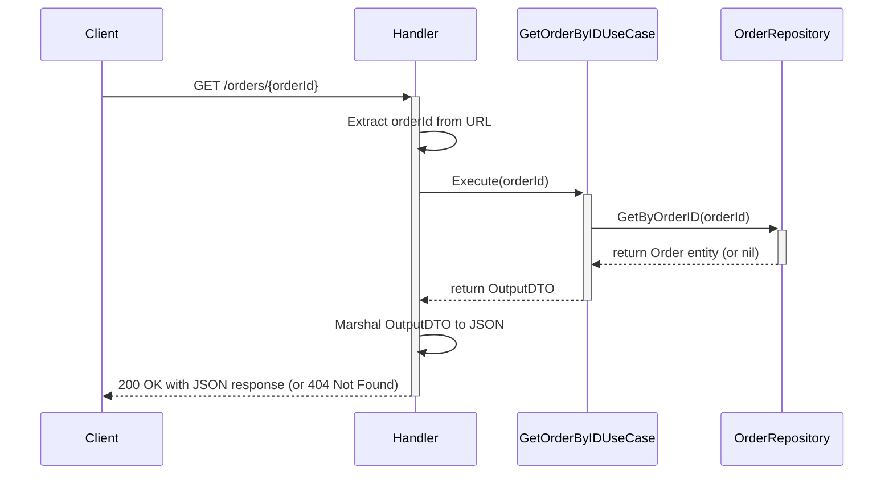
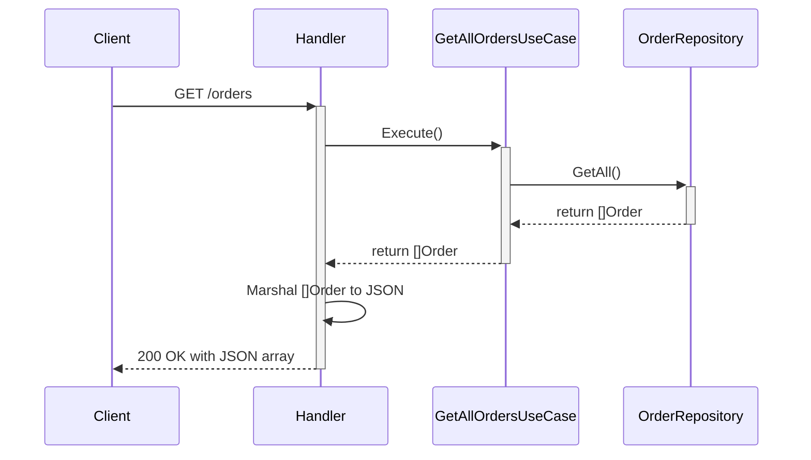

# Go Clean Architecture API

A robust, production-ready REST API for order management, built with Go and Clean Architecture principles. This project demonstrates separation of concerns, testability, and scalability, with real-world features like MySQL, AWS SQS, and full mocking for development.

---

## Table of Contents
1. [Project Overview](#project-overview)
2. [Architecture](#architecture)
3. [Code Structure](#code-structure)
4. [Use Case Flowcharts](#use-case-flowcharts)
5. [API Endpoints & Examples](#api-endpoints--examples)
6. [Configuration](#configuration)
7. [How to Run](#how-to-run)
8. [Testing](#testing)
9. [Database Schema](#database-schema)
10. [Containerization with Docker](#containerization-with-docker)
11. [Contributing](#contributing)

---

## Project Overview

This API manages customer orders and demonstrates how to build scalable, maintainable Go web services using Clean Architecture. It supports full mocking for development and real integrations (MySQL, AWS SQS) for production.


This project is a REST API built in Go, demonstrating the principles of Clean Architecture. It provides a foundation for building scalable, maintainable, and testable web services. ## API Endpoints & Examples

### POST /orders
Create a new order (sends a message to the message queue).

- **Method:** POST
- **Route:** `/orders`
- **Request Body:**
  ```json
  {
    "Data": "string",
    "OrderId": 123,
    "Status": "string"
  }
  ```
- **Response (201 Created):**
  ```json
  {
    "OrderID": 123,
    "Status": "string",
    "Paid": false
  }
  ```
- **Example:**
  ```bash
  curl -X POST http://localhost:8090/orders \
    -H "Content-Type: application/json" \
    -d '{"Data":"2025-06-23","OrderId":456,"Status":"New"}'
  ```

---

### GET /orders/{orderId}
Retrieve order details by ID.

- **Method:** GET
- **Route:** `/orders/{orderId}`
- **Response (200 OK):**
  ```json
  {
    "OrderID": 123,
    "Status": "Complete",
    "Paid": true
  }
  ```
- **Example:**
  ```bash
  curl http://localhost:8090/orders/123
  ```

---

### GET /orders
Retrieve all orders (returns an array).

- **Method:** GET
- **Route:** `/orders`
- **Response (200 OK):**
  ```json
  [
    {
      "id": "string",
      "Data": "string",
      "OrderId": 123,
      "Status": "string",
      "Paid": true,
      "created_at": "2025-06-23T00:00:00Z",
      "updated_at": "2025-06-23T00:00:00Z"
    },
    ...
  ]
  ```
- **Example:**
  ```bash
  curl http://localhost:8090/orders
  ```

---


## Table of Contents
1.  [Clean Architecture](#clean-architecture)
2.  [Code Organization](#code-organization)
3.  [Use Case Flowcharts](#use-case-flowcharts)
    *   [Create Order Flow](#create-order-flow)
    *   [Get Order by ID Flow](#get-order-by-id-flow)
4.  [Configuration](#configuration)
5.  [How to Run](#how-to-run)
    *   [Prerequisites](#prerequisites)
    *   [Running the Server](#running-the-server)
    *   [Running Tests](#running-tests)
6.  [Database Schema](#database-schema)
7.  [Containerization with Docker](#containerization-with-docker)

## Architecture

This project follows the principles of Clean Architecture, ensuring that business logic is decoupled from frameworks, databases, and external services. The main layers are:

- **Entities**: Core business objects (domain models)
- **Use Cases**: Application-specific business rules
- **Interface Adapters**: HTTP handlers, database and messaging adapters
- **Frameworks & Drivers**: External libraries, main entrypoint, configuration

**Dependency Rule:** All dependencies point inward. Inner layers know nothing about outer layers.

```mermaid
graph TD
    A[Frameworks & Drivers\n(cmd, configs, external)] --> B[Interface Adapters\n(infra/handler, infra/database, infra/messaging)]
    B --> C[Use Cases\n(internal/usecase)]
    C --> D[Entities\n(internal/domain/entity)]
```

---

### What is Clean Architecture?

Clean Architecture is a software design philosophy that separates a system into concentric layers, each with distinct responsibilities. This separation makes your codebase:
- **Easier to test** (business logic can be tested in isolation)
- **Easier to maintain** (changes in one layer have minimal impact on others)
- **Easier to adapt** (swap out frameworks, databases, or interfaces with minimal changes)

**Layer Overview:**
- **Entities:** Core business models and rules (no dependencies on anything else)
- **Use Cases:** Application-specific logic and orchestration (depends only on Entities and interfaces)
- **Interface Adapters:** Adapts data between use cases and frameworks (e.g., HTTP handlers, DB adapters)
- **Frameworks & Drivers:** External tools and libraries (web frameworks, DBs, AWS, etc.)

**The Dependency Rule:**
> Source code dependencies always point inward. Nothing in an inner circle knows anything about outer circles.

This means your business logic never depends on frameworks or external services—making your application robust, portable, and testable.

---

## Code Structure

```
GoCleanArch/
├── cmd/server/main.go        # Main entry point
├── configs/                  # YAML config and loader
├── internal/
│   ├── domain/
│   │   ├── entity/           # Order entity
│   │   └── repository/       # Repository interfaces
│   ├── infra/
│   │   ├── database/         # MySQL and mock DB implementations
│   │   ├── handler/          # HTTP handlers and tests
│   │   └── messaging/        # SQS and mock messaging
│   └── usecase/              # Business use cases (Create, GetByID, GetAll)
├── go.mod, go.sum            # Go modules
├── Dockerfile                # Containerization
└── README.md                 # This documentation
```

---

## Use Case Flowcharts

### Create Order Flow


### Get Order by ID Flow


### Get All Orders Flow


---

GoCleanArch/
├── api/              # OpenAPI/Swagger specs, JSON schema files. (Not used yet)
├── cmd/
│   └── server/
│       └── main.go   # Main application entry point.
├── configs/
│   ├── config.go     # Configuration struct definitions and loader.
│   └── config.yaml   # YAML configuration file for different environments.
├── internal/
│   ├── domain/
│   │   ├── entity/
│   │   │   └── order.go # Defines the Order entity.
│   │   └── repository/
│   │       └── order_repository.go # Defines interfaces for repositories.
│   ├── infra/
│   │   ├── database/
│   │   │   ├── order_repository_mock.go # Mock implementation of the order repository.
│   │   │   └── order_repository_mysql.go # MySQL implementation of the order repository.
│   │   ├── handler/
│   │   │   ├── order_handler.go # HTTP handlers for order endpoints.
│   │   │   └── order_handler_test.go # Integration tests for handlers.
│   │   └── messaging/
│   │       ├── order_message_queue_mock.go # Mock implementation of the message queue.
│   │       └── order_message_queue_sqs.go # AWS SQS implementation of the message queue.
│   └── usecase/
│       ├── create_order.go # "Create Order" use case logic.
│       ├── create_order_test.go # Unit tests for the create order use case.
│       ├── get_order.go # "Get Order by ID" use case logic.
│       ├── get_order_test.go # Unit tests for the get order use case.
│       └── usecase_suite_test.go # Test suite setup for use cases.
├── pkg/              # Public library code. (Not used yet)
├── test/             # Additional external test apps and test data. (Not used yet)
├── go.mod            # Go module definitions.
├── go.sum            # Go module checksums.
└── README.md         # This documentation file.
```

## Use Case Flowcharts

These diagrams illustrate the flow of control for the two main use cases. They are written in Mermaid syntax, which can be rendered by many Markdown viewers like GitHub.

### Create Order Flow


### Get Order by ID Flow

```mermaid
sequenceDiagram
    participant Client
    participant Handler
    participant GetOrderByIDUseCase
    participant OrderRepository

    Client->>+Handler: GET /orders/{orderId}
    Handler->>Handler: Extract orderId from URL
    Handler->>+GetOrderByIDUseCase: Execute(orderId)
    GetOrderByIDUseCase->>+OrderRepository: GetByOrderID(orderId)
    OrderRepository-->>-GetOrderByIDUseCase: return Order entity (or nil)
    GetOrderByIDUseCase-->>-Handler: return OutputDTO
    Handler->>Handler: Marshal OutputDTO to JSON

## Configuration

The application's behavior is controlled by the `configs/config.yaml` file. You can switch between development (mocks) and production (real AWS/MySQL) by changing the `env` property:

- `env: "dev"`: In-memory mocks for DB and queue (default)
- `env: "prod"`: Real MySQL and AWS SQS (provide credentials in config)

You can specify the config file path at runtime with the `-config` flag.

---

## How to Run

### Prerequisites
- Go 1.18+
- (Prod) AWS Account & credentials
- (Prod) MySQL Database
- (Optional) Docker

### Running the Server
From the project root:

**Development Mode (default):**
```bash
go run ./cmd/server/main.go
```

**Production Mode:**
1. Edit `configs/config.yaml` with your AWS and DB credentials
2. Set `env: "prod"`
3. Run:
```bash
go run ./cmd/server/main.go
```

### Running Tests
Run all tests (unit + integration):
```bash
go test -v ./...
```

---

## Database Schema

For production, create the `orders` table in MySQL:
```sql
CREATE TABLE orders (
    id VARCHAR(255) NOT NULL PRIMARY KEY,
    data TEXT,
    order_id INT,
    status VARCHAR(255),
    paid BOOLEAN,
    created_at TIMESTAMP,
    updated_at TIMESTAMP
);
```

---

## Containerization with Docker

**Build the image:**
```bash
docker build -t go-clean-arch-api .
```

**Run the container:**
```bash
docker run -p 8090:8090 go-clean-arch-api
```

---

## Contributing

1. Fork this repo and create a feature branch
2. Write clear, tested code (keep business logic in use cases)
3. Follow existing code style and structure
4. Submit a PR with a clear description

---

