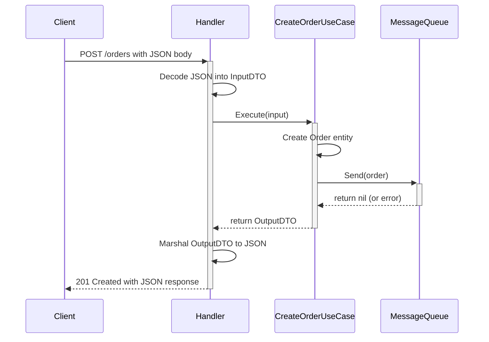
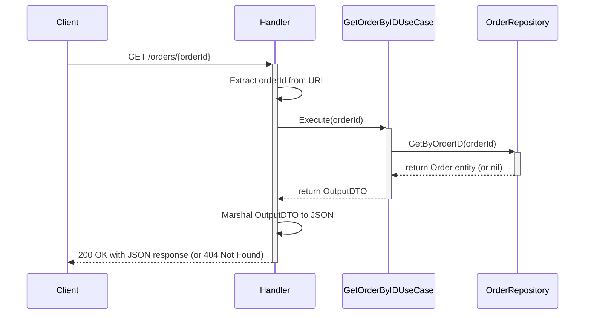

# Go Clean Architecture API

This project is a REST API built in Go, demonstrating the principles of Clean Architecture. It provides a foundation for building scalable, maintainable, and testable web services. The API exposes two endpoints: one for creating orders (which sends a message to a message queue) and another for retrieving order details from a database.

## Table of Contents
1.  [Clean Architecture](#clean-architecture)
2.  [Code Organization](#code-organization)
3.  [Use Case Flowcharts](#use-case-flowcharts)
    *   [Create Order Flow](#create-order-flow)
    *   [Get Order by ID Flow](#get-order-by-id-flow)
4.  [Configuration](#configuration)
5.  [How to Run](#how-to-run)
    *   [Prerequisites](#prerequisites)
    *   [Running the Server](#running-the-server)
    *   [Running Tests](#running-tests)
6.  [Database Schema](#database-schema)
7.  [Containerization with Docker](#containerization-with-docker)

## Clean Architecture

For those new to Go and software architecture, the Clean Architecture is a design philosophy that separates the concerns of a software project into distinct layers. This separation makes the system easier to understand, test, and maintain over time.

The core principle is the **Dependency Rule**: *source code dependencies can only point inwards*. Nothing in an inner circle can know anything at all about something in an outer circle.

This project implements the following layers, from innermost to outermost:

1.  **Entities (`internal/domain/entity`)**: These are the core business objects of the application. In our case, this is the `Order` struct. They are the most general and high-level concepts and have no dependencies on any other layer.

2.  **Use Cases (`internal/usecase`)**: This layer contains the application-specific business rules. It orchestrates the flow of data to and from the entities. Our use cases are `CreateOrderUseCase` and `GetOrderByIDUseCase`. They depend on repository interfaces defined in the domain layer but know nothing about the concrete implementations (like our database or message queue).

3.  **Interface Adapters (`internal/infra`)**: This layer is a set of adapters that convert data from the format most convenient for the use cases and entities, to the format most convenient for some external agency such as the Database or the Web.
    *   **Handlers (`internal/infra/handler`)**: Handle HTTP requests, validate input, and call the appropriate use cases.
    *   **Repositories (`internal/infra/database`)**: Concrete implementations of the repository interfaces defined in the domain layer. This is where our MySQL and mock database logic resides.
    *   **Messaging (`internal/infra/messaging`)**: Concrete implementations of the message queue interfaces. This is where our SQS and mock message queue logic resides.

4.  **Frameworks & Drivers (`cmd/server`, `configs`, external libraries)**: This is the outermost layer, generally composed of frameworks and tools such as the Database, the Web Framework, etc. The `main.go` file, our configuration, and external libraries like `chi` (router) and the AWS SDK live here.

By following this structure, the core business logic (Entities and Use Cases) is completely independent of the web framework, database, or any other external service. This makes it incredibly easy to test the business logic in isolation and to swap out external dependencies without affecting the core of the application.

## Code Organization

The project follows the standard Go project layout.

```
GoCleanArch/
├── api/              # OpenAPI/Swagger specs, JSON schema files. (Not used yet)
├── cmd/
│   └── server/
│       └── main.go   # Main application entry point.
├── configs/
│   ├── config.go     # Configuration struct definitions and loader.
│   └── config.yaml   # YAML configuration file for different environments.
├── internal/
│   ├── domain/
│   │   ├── entity/
│   │   │   └── order.go # Defines the Order entity.
│   │   └── repository/
│   │       └── order_repository.go # Defines interfaces for repositories.
│   ├── infra/
│   │   ├── database/
│   │   │   ├── order_repository_mock.go # Mock implementation of the order repository.
│   │   │   └── order_repository_mysql.go # MySQL implementation of the order repository.
│   │   ├── handler/
│   │   │   ├── order_handler.go # HTTP handlers for order endpoints.
│   │   │   └── order_handler_test.go # Integration tests for handlers.
│   │   └── messaging/
│   │       ├── order_message_queue_mock.go # Mock implementation of the message queue.
│   │       └── order_message_queue_sqs.go # AWS SQS implementation of the message queue.
│   └── usecase/
│       ├── create_order.go # "Create Order" use case logic.
│       ├── create_order_test.go # Unit tests for the create order use case.
│       ├── get_order.go # "Get Order by ID" use case logic.
│       ├── get_order_test.go # Unit tests for the get order use case.
│       └── usecase_suite_test.go # Test suite setup for use cases.
├── pkg/              # Public library code. (Not used yet)
├── test/             # Additional external test apps and test data. (Not used yet)
├── go.mod            # Go module definitions.
├── go.sum            # Go module checksums.
└── README.md         # This documentation file.
```

## Use Case Flowcharts

These diagrams illustrate the flow of control for the two main use cases. They are written in Mermaid syntax, which can be rendered by many Markdown viewers like GitHub.

### Create Order Flow



### Get Order by ID Flow



## Configuration

The application's behavior is controlled by the `configs/config.yaml` file. You can switch between a development environment (using mocks) and a production environment (using real AWS services) by changing the `env` property.

-   `env: "dev"`: Runs the application with in-memory mocks for the database and message queue. No external services are required.
-   `env: "prod"`: Runs the application with a real MySQL database and AWS SQS message queue. You must provide your credentials in the `prod` section of the config file.

You can also specify the configuration file path at runtime using the `-config` flag.

## How to Run

### Prerequisites
- Go (version 1.18 or later)
- (For Prod Mode) AWS Account and configured credentials
- (For Prod Mode) MySQL Database

### Running the Server

Navigate to the project root directory (`D:\src\golang\CascadeProjects\GoCleanArch`) before running these commands.

1.  **Development Mode (default):**
    ```bash
    go run ./cmd/server/main.go
    ```
    The server will start on port 8090 using mock services.

2.  **Production Mode:**
    a.  Update `configs/config.yaml` with your AWS and database credentials.
    b.  Set `env: "prod"` in the config file.
    c.  Run the server:
    ```bash
    go run ./cmd/server/main.go
    ```

### Running Tests

To run the entire test suite (unit and integration tests), run the following command from the project root:

```bash
go test -v ./...
```

## Database Schema

For production mode, you need to create the `orders` table in your MySQL database using the following schema:

```sql
CREATE TABLE orders (
    id VARCHAR(255) NOT NULL PRIMARY KEY,
    data TEXT,
    order_id INT,
    status VARCHAR(255),
    paid BOOLEAN,
    created_at TIMESTAMP,
    updated_at TIMESTAMP
);
```

## Containerization with Docker

This project includes a `Dockerfile` to containerize the application. This is a great way to run the application in a consistent environment.

### Prerequisites
- Docker Desktop

### Building the Image

To build the Docker image, run the following command from the project root:

```bash
docker build -t go-clean-arch-api .
```

This will create a new Docker image with the tag `go-clean-arch-api`.

### Running the Container

To run the application inside a Docker container, use the following command:

```bash
docker run -p 8090:8090 go-clean-arch-api
```

This will start the container and map port 8090 on your host machine to port 8090 in the container, so you can access the API at `http://localhost:8090`.

**Note:** The Docker container runs using the default `configs/config.yaml` file, which is set to the `dev` environment. To run in production mode, you would need to modify the `Dockerfile` or use Docker volumes to mount a production configuration file.
